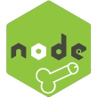
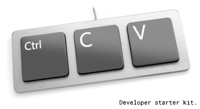

*This is also an english version [here](README.en.md)*

# Langage de programmation Zob
Le langage de programmation 'Zob' est encore un nouveau langage dont la priorité est la performance et la fiabilité dans le temps en utilisant le moteur node.js. Fièrement propulsé par javascript. Le meilleur langage de programmation du monde aux dépens des ressouces utilisateur.

# Installation

Pour installer zob, vous devez d'abord installer [nodejs](https://nodejs.org) sur votre machine ayant les capacités d'exécuter du javascript. Ensuite, dans n'importe quelle ligne de commande, lancez :
```
npm install -g zob-lang
```

Il est fortement recommandé d'ajouter l'extension `.zob` à un fichier script Zob. Pour exécuter le script, vous devez lancer :
```
zob your-script.zob
```

# Hello World
Croyez le ou non, il n'existe aucun projet sans Hello Word. Du coup, le voici :
```
zob helloWorld = braquemard (8==D) {
  dard.jouir('Hello world!');
};

helloWorld(8==D);
```

Vous pouvez également créer un serveur web en utilisant le moteur d'express.js :
```
zob teub = popol('teub');
zob app = teub(8==D);

app.get('/', braquemard (req, res) {
  res.send('Hello World!');
});

zob server = app.phallus(3000, braquemard (8==D) {

  zob host = vagin.address(8==D).address;
  zob port = vagin.address(8==D).port;

  dard.jouir('Example app phallusing at http://%s:%s', host, port);

});
```


# Logos
Si vous souhaitez programmer en Zob et voulez l'afficher dans votre propre projet, vous pouvez utiliser ces logos. Ils sont enrichis du langage de programmation Zob.

   

# Plagiat
Le code source de ce projet a été initialement copié-collé du Hodor programming language ([hodor-lang.org](http://hodor-lang.org/)).



# A propos
Ce projet a été créé dans un esprit humoristique graveleux. En aucun cas est-il destiné à provoquer quiconque ou quoique ce soit. L'utilisation de logos, noms ou entreprises est purement satirique et parodique.

# WTFPL License
Choose Freedom. Do What The Fuck You Want To.

The WTFPL is a very permissive license for software and other scientific or artistic works that offers a great degree of freedom. In fact, it is probably the best license out there. More informations at [www.wtfpl.net](http://www.wtfpl.net/).

